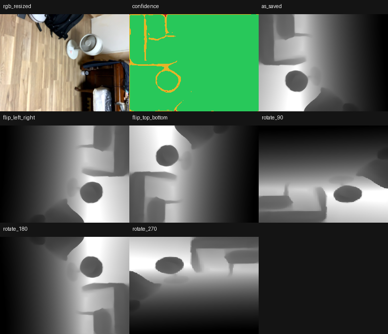
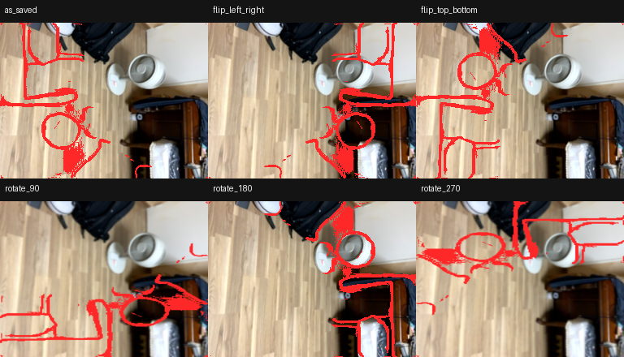
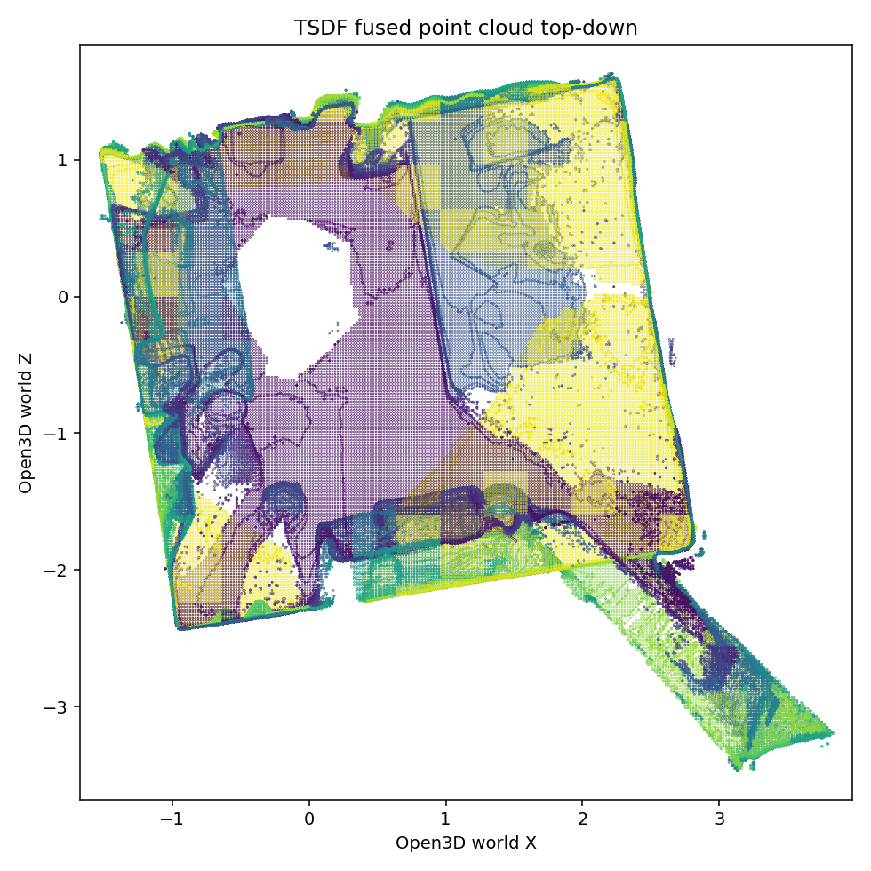
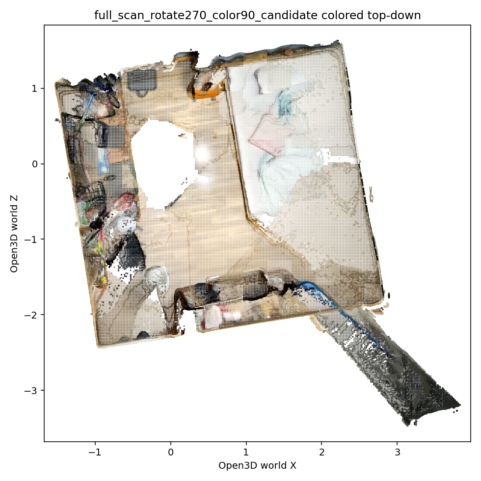

# MemoAnchor 3D Reconstruction 요약

## 최종 방향

iPad에서 RGB-D 스캔 데이터를 저장하고, Mac/server에서 Open3D TSDF로 3D mesh를 만든 뒤, 결과를 iPad와 Web viewer에서 확인하는 방식으로 정리했다.

```text
iPad 스캔
→ RGB-D dataset 저장
→ 서버로 ZIP 업로드
→ Open3D TSDF reconstruction
→ result.ply 생성
→ iPad 앱에서 다운로드 후 preview
→ Mac에서는 HTML viewer로 확인
```

## 왜 이 방식인가

RTAB-Map native/iOS 직접 연결은 빌드와 ARSession 충돌 리스크가 컸다. 반면 Open3D server 방식은 실제 스캔 데이터로 방 구조와 텍스처가 확인 가능한 결과를 만들었다.

## 검증 결과

검증 dataset:

```text
scan_20260718_163137
```

결과:

```text
사용 frame: 301
제외 frame: 0
vertices: 181,727
triangles: 347,922
처리 시간: 약 20초
```

핵심 보정값:

```text
depth transform: rotate_270
color transform: rotate_90
```

## 결과 이미지

### 1. RGB-D 방향 후보 비교



### 2. Depth edge alignment 비교



### 3. Geometry-only TSDF 결과



### 4. Colored TSDF 결과



## 서버 실행

```bash
cd <repo-root>

tools/reconstruction/.venv/bin/python tools/reconstruction_server/server.py \
  --host 0.0.0.0 \
  --port 8765
```

iPad 업로드 URL:

```text
http://<mac-lan-ip>:8765/upload
```

Mac viewer:

```text
http://127.0.0.1:8765/viewer?scan=<scanId>
```

같은 Wi-Fi 기기 viewer:

```text
http://<mac-lan-ip>:8765/viewer?scan=<scanId>
```

## 구현된 내용

- iPad 앱에서 RGB-D dataset 저장
- Stop scan 시 ZIP 패키징
- ZIP 안에 `rgbd_dataset/` 포함
- 서버에서 ZIP 수신 및 압축 해제
- 서버에서 RGB-D dataset 자동 탐색
- Open3D TSDF reconstruction 실행
- `result.ply` 생성
- iPad에서 결과 다운로드 후 preview
- Mac/server에서 HTML viewer 제공

## 현재 결론

이제 reconstruction 방향은 확정해도 된다.

```text
RTAB-Map native 직접 연결: 보류
Open3D RGB-D TSDF server pipeline: 채택
```

앞으로는 알고리즘을 다시 갈아엎는 단계가 아니라, 업로드/처리 상태 표시/viewer UX/mesh 최적화를 다듬으면 된다.

